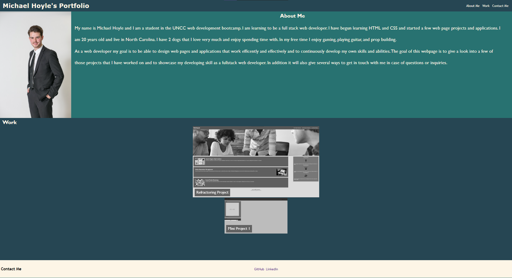

# professional-portfolio

## Project Description
In this project the task at hand was desiging a personal portfolio page to give a little personal detail, show off some projects that have already been finished, and link to some personal pages for contact. In this project we were supposed to include our name, a recent photo, a link to a section about me, my work, and a way to contact me. The project needed to include a working nav bar with internal links to the difference sections on the page which it has, styled with a hover element over the links. There needed to be images of previous projects and a brief title and an ability to click a link to a previously deployed project. I used screenshot pictures of the two projects I included and styled them so they are greyscale unless in the hover state. They also animate a little when hovered over in which they move slightly. One of the two was also supposed to be bigger than the other and serve as a "feature" project. The images themselves also needed to be the links to the deployed projects. There also needed to be media queries indicating what will happen if the screen is resized. In my project there was a particular section that was not working well when I resized my page and that was something that had to be addressed within media queries. I also spent a while using flexbox to style and organize my page and had some trouble figuring out how to get things layed out how I wanted but eventually I was able to figure everything out and get everything looking how I wanted. 

## Project Link
The project site can be found [here](https://choyle-01.github.io/professional-portfolio/)

## Github Repository
The Github repository can be found [here](https://github.com/choyle-01/professional-portfolio)

## Visuals
